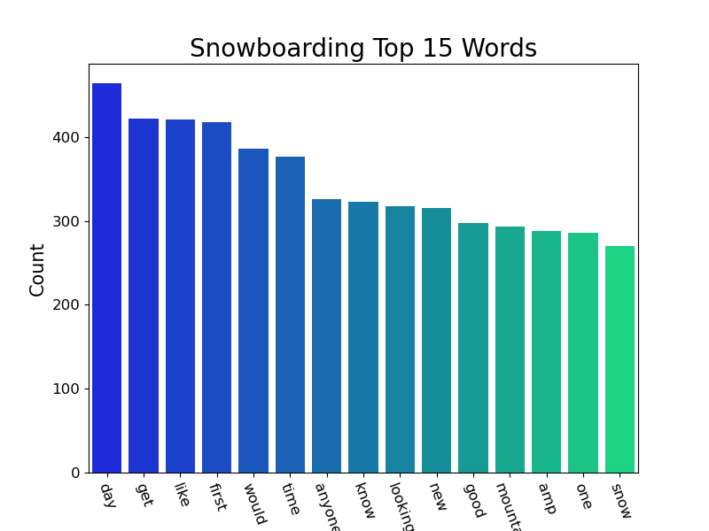
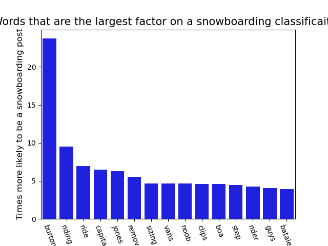

#  Project 3: Web APIs & NLP

### Subreddit Snowboarding vs Skiing trends

### Problem Statement:

Breaking into a new market is tricky. When a company is known for one thing, how can the broaden their base to include another, new, group?  Icelandic Skis is a small, high end ski manufacturing company based in Golden, CO.  They are (fictionally) considering entering the snowboarding market.  Without utlizing too much employee time or additional marketing capital, how can they broaden their reach using Reddit data? 

### Background

Reddit is a collection of online discussion boards known as "subreddits", which cover a variety of topics. The goal of this project is to classify which subreddit a given post came from. Our focus will be on Skiing and Snowboarding.  We will be comparing a variety of models (Logistic, multinomial Naive Bayes, TFIDF as well as a random forest) to see if there are language uses unique within each subreddit, in order to predict if a post came from which subreddit. Our results should assist the company (or any user for that matter) use these models in other forums to target their desired client. 

### Datasets

I utilized the [Pushshift API](https://github.com/pushshift/api) to download 5000 submissions from both the skiing and snowboarding subreddit.  These were then cleaned and appended to create on large dataset.  

---

### Deliverables

README- Horwitz.md, provides instruction and overview of the project

code- Folder containing
1) ski vs snowboard cleaning.ipynb- Jupyter notebook, import and cleaning data
2) EDA.ipynb- Jupyter notebook, data analysis, graph creation
3) Naive Bayes and Log Reg.ipynb- Jupyter notebook, running NB and LogReg models on different stemming/lemmatizing of data
4) TFIDF.ipynb- Jupyter notebook, running TFIDF models on different stemming/lemmatizing of data
5) Random Forest.ipynb - Jupyter notebook, running a Random Forest model
6) Removed.ipynb - Jupyter notebook, seeing trends in what snowboarding posts were removed

data- Folder containing
1) cleaned.csv- csv, initial cleaned data, two columns, text and subreddit
2) snowboard_removed.csv- csv, intial data cleaned just snowboarding with selftext column inplace
3) stemmed.csv- csv, initial data with stopwords removed then data stemmed/lemmatized 

images- Folder containing various imagines made throughout EDA and modeling. 

Presentation - pdf of the presentaiton, also found at https://docs.google.com/presentation/d/17DL5Ww0vOOiu2_7i43i8AkGmTyKHyyO3XP51DgPDTjM/edit?usp=sharing

|Feature|Type|Dataset|Description|
|---|---|---|---|
|subreddit|int|cleaned|snowboard:1, skiing:0| 
|text|object|cleaned (as well as snowboard_removed and stemmed)|string of text from a subreddit submission|
|tokenized|object|stemmed|text column tokenized|
|no_stopwords|object|stemmed|tokenized column with english stopwords and most popular words removed|
|stemmed|object|stemmed|no_stopwords word stems| 
|length|int|stemmed|number of words of each submission| 
|selftext|object|snowboard_removed|title of the post| 
|title|object|snowboard_removed|body of the post| 

## Executive summary

Subreddit is a website that hosts a wide number of discussion board, Pushshift API allows a user to pull a lot of posts from a particular subreddit (board) to analyze.  The data comes in with 99 columns, through some analysis I decided that text (a combination of title and body) as well as length of post (words) as the factors I wanted to examine.

Text was one long string so I decided to look at the words in different ways.
1) Leave it as is
 
 

2) Remove stopwords, along with the most common tell words (variations of "ski" and "snowboard")

 

3) Stemmed words
To obtain the later two columns I tokenized the text before 2) removing a custom list of stopwords and then 3) use porterstemmer to obtain a string of only stemmed words. 

In addition I also wanted to explore if the length of a submission was impactful.  

After cleaning and organizing the data into different columns of a dataframe, I ran each column through a variety of models: Logistic, multinomial Naive Bayes and TFIDF, include text length and not. I also included a random forest as well. For each (most) models I set up a grid search to optimize parameters and did a few iterations to get the best results. The models accuracy, sensitivity... varied dramatically, but far and wide were better than the 50% expected baseline.  

In the end there are three models that are "best" at different things. One has the best sensitivity (highest odds of correctly identifying a snowboarder), another has the highest precision (highest odds of have one predicted to be a snowboarder, being a snowboardeer) and yet another has the highest accuracy (correctly assigned the right category).  

I also explored what words had the greatest weight in the classification of one group over another and did the same to see if the presence of any words impacted if the post was removed by the moderator.  

## Conclusion and Recommendations

Each model has a vary level of success distinguish between a snowboarding and skiing thread. Depending on budget and tolerance for miss predictions we can use a chose model and apply it to other venues: subreddit threads regarding Ski resorts, mountain towns… extend to include facebook

The company can then use these reults to determine if 
- If a venue/mountain tends to draw more people who “talk” snowboard (and likely snowboard and be interested in their product)
- If an individual is more likely to identify with a snowboard/ski crowd

And then market accordingly.

